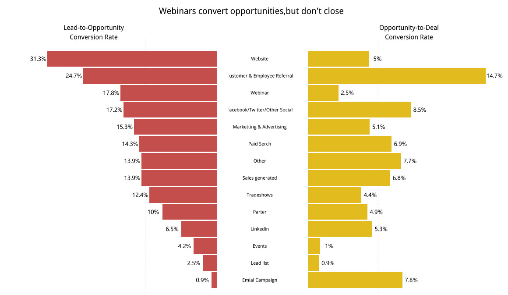

<center><h1>蝴蝶图的绘制</h1></center>
本文是学习<a href="https://zhuanlan.zhihu.com/p/29101316"』>杜雨</a>的文章而做的，

利用ggplot2绘制蝴蝶图，要点包括：
<ol>
<li>坐标轴翻转</li>
<li>grid系统进行版式布局</li>
</ol>
<center><h3>导入包，构建数据集</h3></center>
```{r}
library(ggplot2)
library(dplyr)
library(grid)
library(showtext)
library(Cairo)

mydata <- data.frame(
  id = 1:14,
  A = c(5, 14.7, 2.5, 8.5, 5.1, 6.9, 7.7, 6.8, 4.4, 4.9, 5.3, 1, 0.9, 7.8),
  B = c(31.3, 24.7, 17.8, 17.2, 15.3, 14.3, 13.9, 13.9, 12.4, 10, 6.5, 4.2, 2.5, 0.9),
  Label = c("Website", "Customer & Employee Referral", "Webinar", "Facebook/Twitter/Other Social", "Marketing & Advertising", "Paid Serch", "Other", "Sales generated", "Tradeshows", "Parter", "Linkedin", "Events", "Lead list", "Emial Campaign")
)
```

<center><h3>绘制第一个柱形图</h3></center>
```{r}
p <- ggplot(data = mydata)
p1 <- p + geom_bar(aes(x = id, y = A), stat = "identity", fill = "#E2BB1E", colour = NA, width = 0.9) ##identity是必须的

##添加辅助线
p2 <- p1 + geom_hline(yintercept = mean(mydata$A), linetype = 3, colour = "red")
p2
##旋转
p3 <- p2 + coord_flip()
p3

##添加label，并调整位置，字体大小
p4 <- p3 + geom_text(aes(x = id, y = -5, label = Label), vjust = 0.5, size = 3, family = "Times") 
p4
##为与原图对应，将图上下颠倒
p5 <- p4 + scale_x_reverse()
p5
##为让所有label显示出来
p6 <- p5 + ylim(-10, 18)
p6
##添加数据
p7 <- p6 + geom_text(aes(x = id, y = A + 1, label = paste0(A, "%")), size = 3, vjust = 0.5, hjust = 0.75, family = "Times")
p7
##去除坐标轴等
p8 <- p7 + theme_void()
p8
```

<center><h3>绘制第二个柱形图</h3></center>
```{r}
q <- ggplot(data = mydata)
##-B
q1 <- q + geom_bar(aes(x = id, y = -B), fill = "#C44E4C", colour = NA, stat = "identity")
q2 <- q1 + coord_flip() + scale_x_reverse()
q3 <- q2 + geom_text(aes(x = id, y = -B-0.75, label = paste0(B,"%")), size = 3, vjust = 0.5, family = "Times", fontface = "bold", hjust = 0.75) 
q3
q4 <- q3 + geom_hline(yintercept = mean(-(mydata$B)), linetype = 3) + theme_void()
q4
```
<center><h3>图形整合</h3></center>
```{r}
##打开图形设备
CairoPNG(filename = "butterfly.png", width = 1200, height = 696)
## 为当前图形设备添加text
showtext.begin()
##新建页面
grid.newpage()
##将页面分成7*11矩阵
pushViewport(viewport(layout = grid.layout(7, 11))) 
## 根据给定的写x,y来定位创建viewport
vplayout <- function(x, y){
  viewport(layout.pos.col = y, layout.pos.row = x)
}
## 使用页面矩阵的2：7行，1:5列绘制
print(q4, vp = vplayout(2:7, 1:5))
print(p8, vp = vplayout(2:7, 6:11))
## grid.text中label输入文字，x和y用的是相对位置，x=0.95代表x方向上95%位置处，
##gpar是grid参数
grid.text(label="Opportunity-to-Deal\nConversion Rate",x=.80,y=.88,gp=gpar(col="black",fontsize=15,fontfamily="myfzhzh",draw=TRUE,just="centre"))
grid.text(label="Lead-to-Opportunity\nConversion Rate",x=.20,y=.88,gp=gpar(col="black",fontsize=15,fontfamily="myfzhzh",draw=TRUE,just="centre"))
grid.text(label="Webinars convert opportunities,but don't close",x=.50,y=.95,gp=gpar(col="black",fontsize=20,fontfamily="myfzhzh",draw=TRUE,just="centre"))
##关闭
showtext.end()
##关闭图形设备
dev.off()
```


