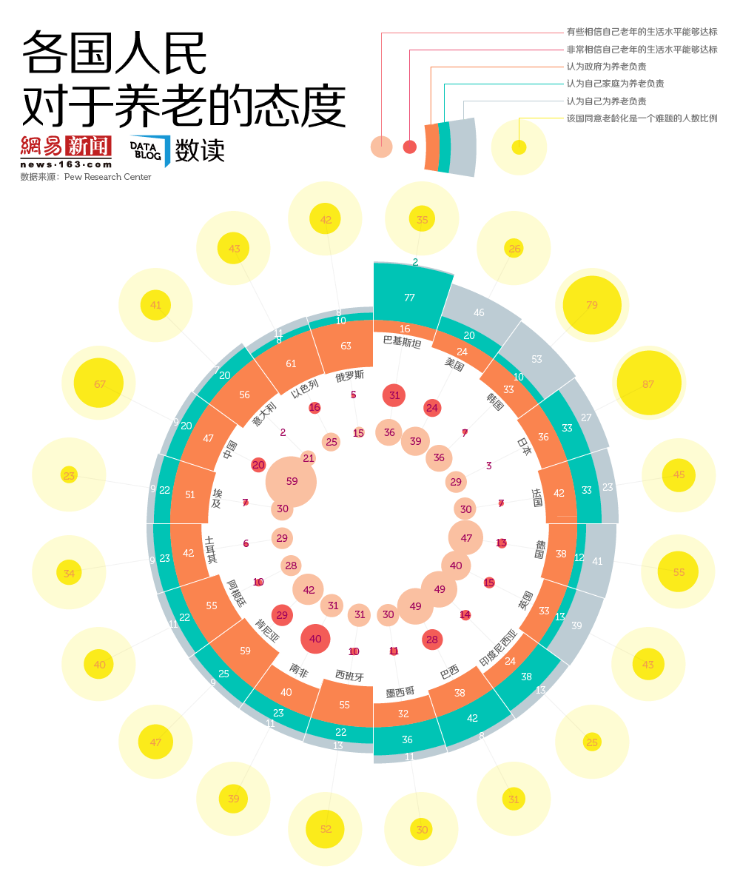

```{r}
##导入包
library(ggplot2)
library(Cairo)
library(showtext)
library(dplyr)
library(tidyr)
library(ggthemes)
library(reshape2)
library(ggsci)
##构建数据
circle_bubble <- data.frame(
  State = c("巴基斯坦", "美国", "韩国", "日本", "法国", "德国", "英国", "印度尼西亚", "巴西", "墨西哥", "西班牙", "南非", "肯尼亚", "阿根廷", "土耳其", "埃及", "中国", "意大利", "以色列", "俄罗斯"),
  General = c(36, 39, 36, 29, 30, 47, 40, 49, 49, 30, 31, 31, 42, 28, 29, 30, 59, 21, 25, 15),
  Very = c(31, 24, 7, 3, 7, 13, 15, 14, 28, 11, 10, 40, 29, 10, 6, 7, 20, 2, 16, 5),
  Government = c(16, 24, 33, 36, 42, 38, 33, 24, 38, 32, 55, 40, 59, 55, 42, 51, 47, 56, 61, 63),
  Family = c(77, 20, 10, 33, 33, 12, 13, 38, 42, 36, 22, 23, 25, 22, 23, 22, 20, 20,8 ,10),
  Yourself = c(2, 46, 53, 27, 23, 41, 39, 13, 8, 11, 13, 11, 9, 11, 9, 9, 9, 7, 11, 8),
  Ratio = c(35, 26, 79, 87, 45, 55, 43, 25, 31, 30, 52, 39, 47, 40, 34, 23, 67, 41, 43, 42)
)
```

```{r}
##数据整理
circle_bubble$State <- factor(circle_bubble$State, levels = circle_bubble$State)
circle_point <- circle_bubble[, c(1, 2, 3, 7)]
circle_bar <- circle_bubble[, c(1, 4, 5, 6)]
circle_bar$Government <- -circle_bar$Government
circle_point_data <- melt(circle_point, id.vars = "State", variable.name = "Class", value.name = "Value")
circle_bar_data <- melt(circle_bar, id.vars = "State", variable.name = "Class", value.name = "Value")

circle_bar_data <- within(circle_bar_data, {
  label_y = NA
  label_y[Class == "Government"] <- circle_bar$Government/2
  label_y[Class == "Yourself"] <- circle_bar$Yourself/2
  label_y[Class == "Family"] <- circle_bar$Family/2 + circle_bar$Yourself
})

circle_point_data <- within(circle_point_data, {
  mood_y <- NA
  mood_y[Class == "General"] <- -150
  mood_y[Class == "Very"] <- -100
  mood_y[Class == "Ratio"] <- 140
})

circle_point_data$Value_y <- ifelse(circle_point_data$Class == "Ratio", circle_point_data$Value, circle_point_data$Value*0.3)
```


```{r}
p <- ggplot() + geom_linerange(data = circle_bar_data, aes(x = State, ymin = -250, ymax = 150), colour = "#D8E5F2", size = 0.25, alpha = 0.7) + geom_col(data = circle_bar_data, aes(x = State, y = Value, fill = Class), width = 1, size = 0.25) + theme(text = element_text(family = "STHeiti")) 

p1 <- p + geom_text(data = circle_bar_data, aes(x = State, y = label_y, label = Value), colour = "white", size = 4, family = "Times")

p2 <- p1 + geom_point(data = circle_bubble, aes(State, y = 140), colour = "#FEFCD3", size = 40, alpha = 0.8) + geom_point(data = circle_point_data, aes(x = State, y = mood_y, colour = Class, size = Value_y))

p3 <- p2 + geom_text(data=filter(circle_point_data,mood_y==-150),aes(x=State,y=mood_y,label=Value), colour="#AA1A66",size=4) + geom_text(data=filter(circle_point_data, mood_y==-100),aes(x=State, y=mood_y, label=Value), colour="#A31067", size=4)+
geom_text(data=filter(circle_point_data, mood_y==140),aes(x=State, y=mood_y, label=Value), colour="#F29E4A", size=5)

p4 <- p3 + geom_text(data = circle_point_data, aes(x = State, y = -80, label = State), family = "STKaiti")

p5 <- p4 + scale_fill_manual(values=c("#FA844F","#BDCCD4","#00C4B5")) + scale_colour_manual(values=c("#FAC0A1","#F35C57","#FBEB1B")) + scale_size_area(max_size=34) +  coord_polar()
p5
p6 <- p5 + guides(colour = FALSE, size = FALSE, fill = FALSE) + theme(axis.text.x = element_blank())
p6
```

