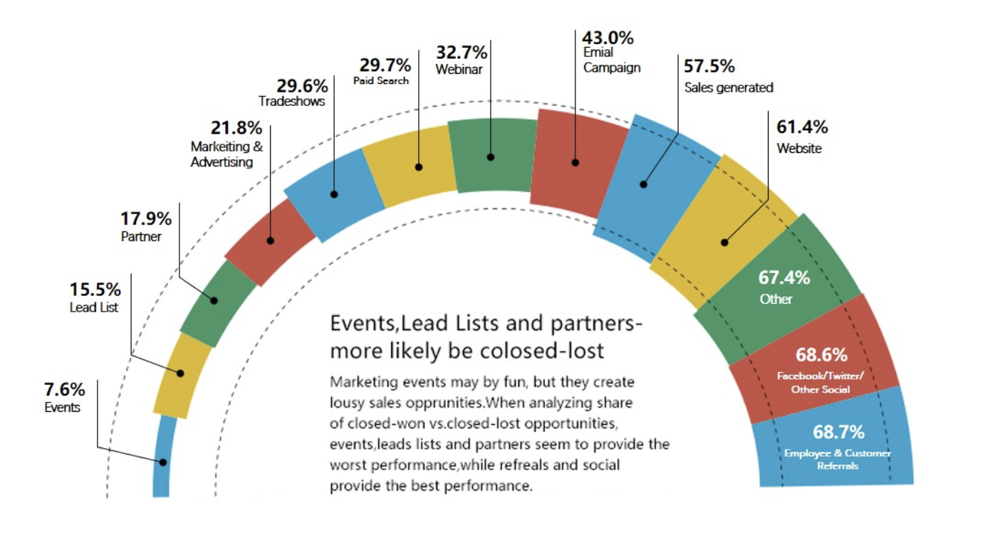
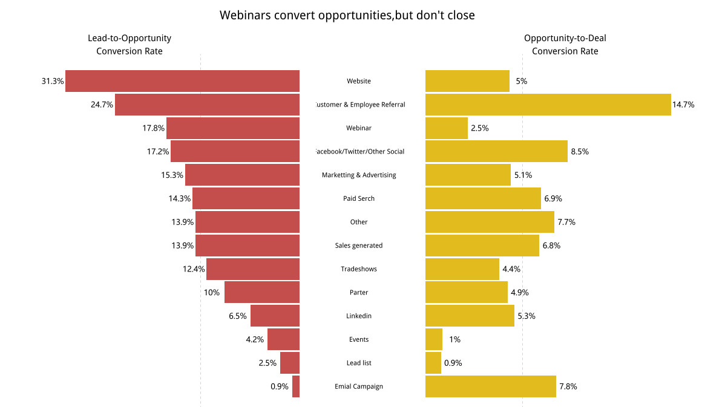

# R_plot
ggplot2图形绘制学习模仿[17.09.09-17.09.16]

##2017.09.09
<a href = "https://zhuanlan.zhihu.com/p/29126173">半圆图</a>
<ol>
<li>极坐标的转换</li>
<li>辅助线的添加</li>
<li>角度位置的调整</li>
</ol>

##2017.09.10
<a href = "https://zhuanlan.zhihu.com/p/29101316">蝴蝶图</a>
<ol>
<li>坐标轴的颠倒</li>
<li>辅助线的添加</li>
<li>标签的添加</li>
</ol>

